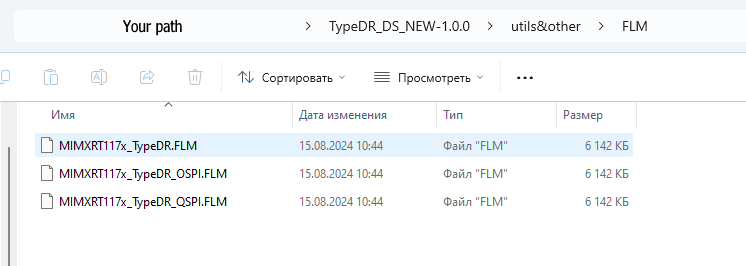
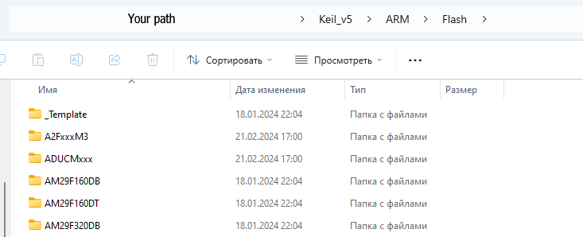
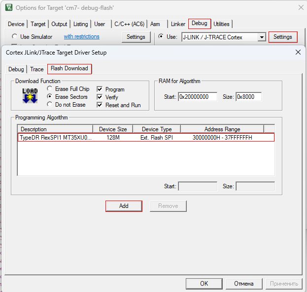

# 
Adding flm file into your Keil
### 
open folder `utils&other/FLM`
### 
copy all files from directory

{ align=center }
### 
go to open folder `Keil_v5/ARM/Flash` (I dont know where u installed him, for example `C:/Keil_v5`)
### 
copy all files from step 2 in this dir

{ align=center }
### 
check in keil (add .flm algorithm in project)

{ align=center }
### 
if everything went well at this stage, you can upload the application to the board with a demo version, for normal operation of the board it