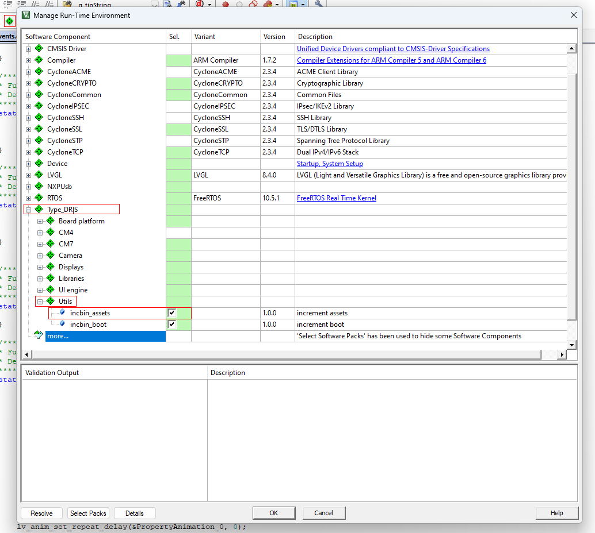

# 
Using Assets

* The converter is on the path `vega sdk->image converter`
*  Copy all your resources (in PNG format) to the assets folder
*  Run the converter and wait for the conversion to finish
*  As a result you will get 2 files, assets.bin/c, copy them to the root directory (TypeDR_DS_XXX) 
##### 
if the files do not appear after conversion, just update the folder

#### After that, go to Keil, and enable the incbin_assets component in the DFP package
{ align=center }

###### After updating the firmware and loading resources, the component can be turned off so as not to change the resources every time the panel is updated.