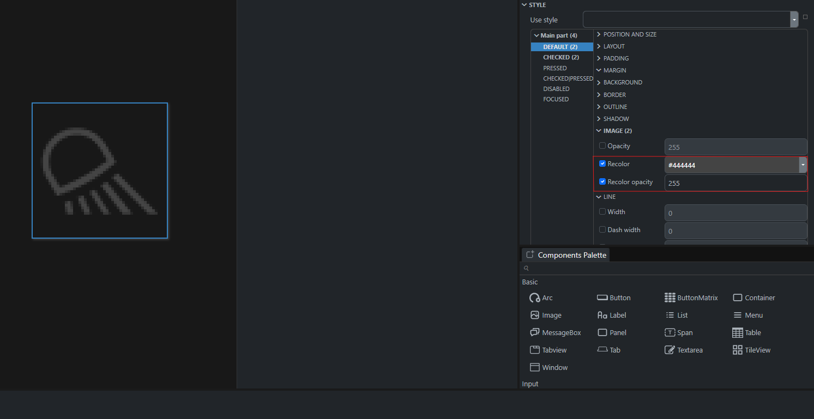
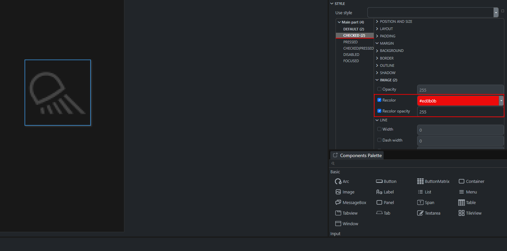
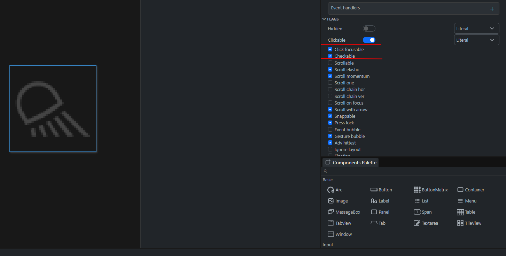

# Getting Started in EEZ Studio

#### Open the project located in the Eez_project folder, downloaded together with the main project from the launcher.

#### Each screen is named by the preset name, with the designation of belonging to the rendering layer, for example: 
```
Preset_Demo_Screen_Ico
Preset_Demo_Screen_Background
```

#### The background can be set on all screens for more convenient creation of interfaces.

#### All changes in color/icons, etc. occur according to states, which are either set from the program or by the touchscreen (does not apply to the 12" display)

#### An example of redrawing an icon depending on its state, which is set using the touch screen.

* First, we recolor the icon from its original color to gray to give it a disabled look

<center>{ align=center } </center>

* Next, we select the state that we will use (it is recommended to use checked, in most cases this is the best possible solution) and style the icon to match our state.

<center>{ align=center } </center>

* After all this, we check whether the clickable and checkable flags are enabled.

<center>{ align=center } </center>

* That's all, now the icon will switch its state when you click on it.
